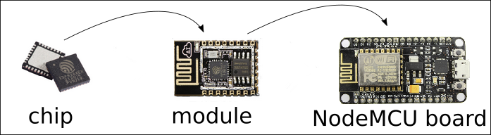

# Tutorials : Electronics : ESP8266

## 1) What is ESP8266

ESP8266 is an electronic chip. The best way to use this chip is through a development board that 
has all pins ready to connect on a protoboard.




## 2) How to setup this board in Arduino IDE

- Go to menu File -> Preferences
- In "Additional Boards Manager URLs" field fill this URL: http://arduino.esp8266.com/stable/package_esp8266com_index.json
- Go to menu Tools -> Board: "Arduino/Genuino Uno" -> Boards Manager
- Select the item "esp8266 by ESP8266 Community" -> Install
- Go to menu Tools -> Board: "Arduino/Genuino Uno"
- Select "Generic ESP8266 Module"

## 3) Create a sketch named "esp8266_ldr"

```
void setup() {
  pinMode(16, OUTPUT);
  pinMode(5, OUTPUT);
  pinMode(4, OUTPUT);
  pinMode(0, OUTPUT);
  pinMode(2, OUTPUT);
  
  Serial.begin(9600);
}

void loop() {
  digitalWrite(16, LOW);
  digitalWrite(5, LOW);
  digitalWrite(4, LOW);
  digitalWrite(0, LOW);
  digitalWrite(2, LOW);
  
  int sensorValue = analogRead(A0);

  float voltage = sensorValue * (5.0 / 1023.0);

  if (voltage > 0.0 && voltage < 1.5) {
    digitalWrite(16, HIGH);
  } else if (voltage >= 1.5 && voltage < 2.5) {
    digitalWrite(16, HIGH);
    digitalWrite(5, HIGH);
  } else if (voltage >= 2.5 && voltage < 3.5) {
    digitalWrite(16, HIGH);
    digitalWrite(5, HIGH);
    digitalWrite(4, HIGH);
  } else if (voltage >= 3.5 && voltage < 4.5) {
    digitalWrite(16, HIGH);
    digitalWrite(5, HIGH);
    digitalWrite(4, HIGH);
    digitalWrite(0, HIGH);
  } else if (voltage >= 4.5) {
    digitalWrite(16, HIGH);
    digitalWrite(5, HIGH);
    digitalWrite(4, HIGH);
    digitalWrite(0, HIGH);
    digitalWrite(2, HIGH);
  }

  Serial.println(voltage);
  delay(500);
}
```

Click the upload button with the USB cable connected to the board.

An error about permission may occurs:

```
serial.serialutil.SerialException: [Errno 13] could not open port /dev/ttyUSB0: [Errno 13] Permission denied: '/dev/ttyUSB0'
An error occurred while uploading the sketch
```

If you are running on a Linux desktop, you can type this command at the console:

`sudo usermod -a -G dialout yourname`

You'll need to log out and in to this change take effect.

Then, try to upload the code again to the board.


